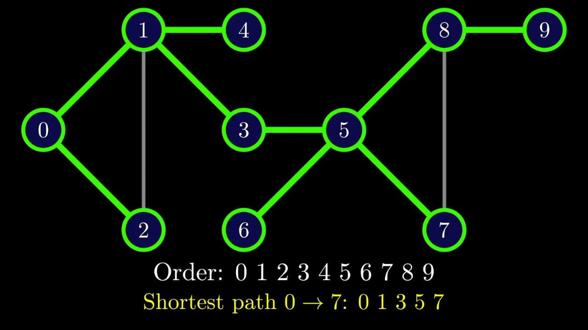

# DSPD Practical 09

Breadth-First Search (BFS) is a graph traversal algorithm that explores all the vertices of a graph or tree in breadth-first order, i.e., it visits all the nodes at the same level before moving on to the next level.

Starting from a given node, BFS visits all the nodes connected to it by an edge, then visits all the nodes connected to these nodes, and so on. It keeps track of all the nodes visited and the nodes that are yet to be visited. BFS is usually implemented using a queue data structure that stores the nodes to be explored.

Here is how the BFS algorithm works:

1. Start from the given node and add it to the queue.
2. Mark the current node as visited.
3. While the queue is not empty, do the following:
a. Remove the node from the front of the queue.
b. For each of the node's neighbors that have not been visited, mark them as visited and add them to the end of the queue.
4. Repeat step 3 until the queue is empty.

BFS is useful in finding the shortest path between two nodes in an unweighted graph, or in finding the minimum number of moves required to reach a target node in a game, among other applications.

