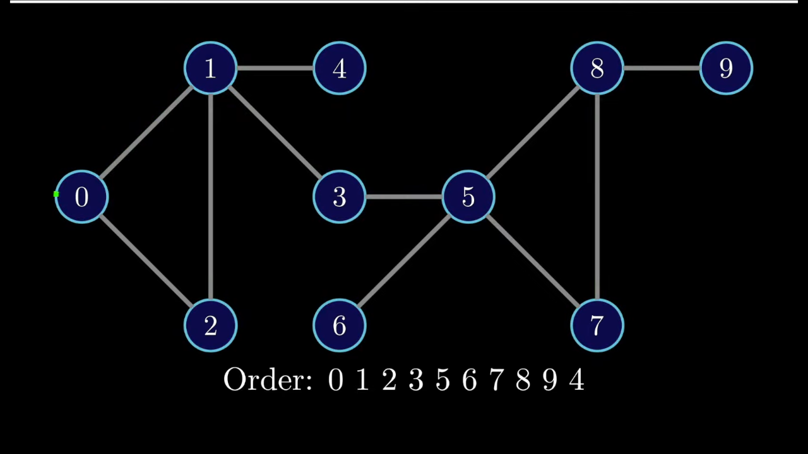

# DSPD Practical 10

Depth First Search (DFS) is an algorithm used to traverse a graph or a tree data structure. The algorithm starts at a specific node, called the root, and explores as far as possible along each branch before backtracking.

To perform DFS, the algorithm follows the following steps:

1. Mark the current node as visited
2. Recursively visit all adjacent nodes that have not been visited
3. Backtrack to the previous node and repeat step 2 for any unvisited adjacent nodes until all nodes have been visited

DFS can be implemented using either recursion or iteration. In the recursive implementation, a stack is implicitly maintained by the call stack, whereas in the iterative implementation, an explicit stack data structure is used to keep track of the nodes to visit.

DFS is often used for solving problems that involve finding a path or a cycle in a graph, determining connectivity between nodes, and searching for a solution in a tree data structure. It has a time complexity of O(V + E), where V is the number of vertices and E is the number of edges in the graph.

